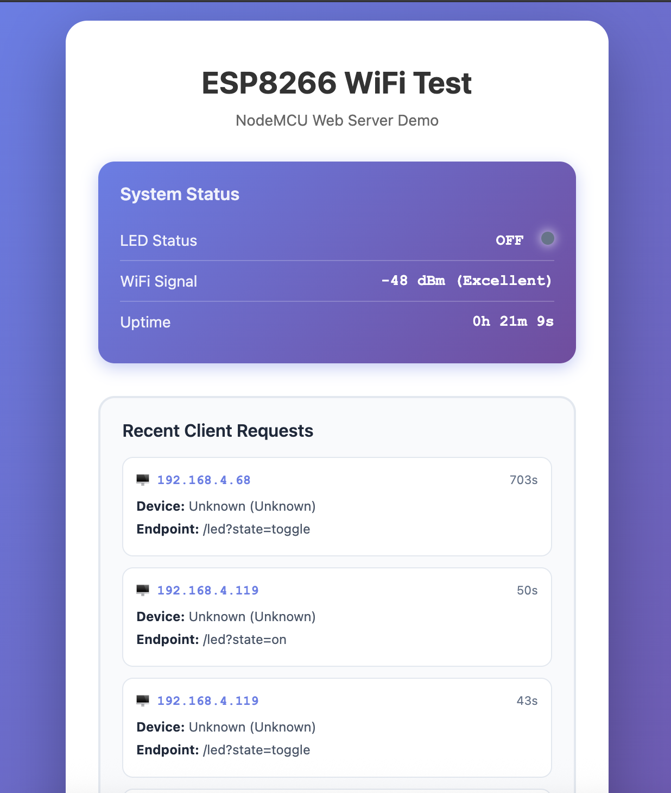
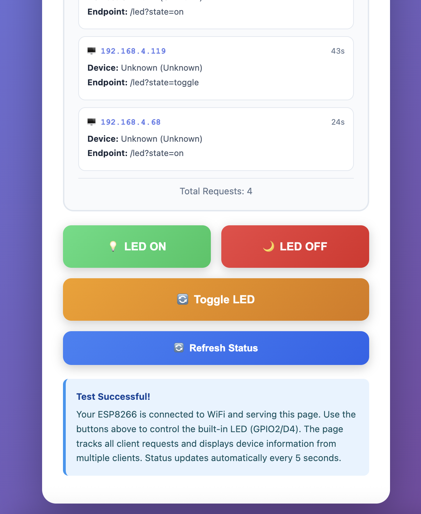

# ESP8266 Wi-Fi based LED Control 


ESP8266 NodeMCU web server implementation featuring real-time multi-device client tracking, REST API endpoints, and responsive web interface. Perfect for IoT experimentation, embedded systems learning, and as a foundation for ESP8266 Wi-Fi module projects.

---

## 🎯 Project Overview

This project demonstrates a simplistic ESP8266 web server with client tracking capabilities. It serves as both an educational resource for learning ESP8266 Wi-Fi fundamentals and a practical testing platform for multi-device IoT communication.

### Key Features

- ✅ **mDNS Support** - Access via `esp8266-wifi.local` instead of IP addresses
- ✅ **Multi-Device Access** - Simultaneous connections from laptop, smartphone, tablet
- ✅ **Client Tracking** - Real-time monitoring of client IP addresses and request history
- ✅ **REST API** - JSON endpoints for status, LED control, and client data
- ✅ **Responsive Web UI** - Mobile-friendly interface with auto-refresh
- ✅ **Device Detection** - Automatic identification of device type and browser
- ✅ **Request History** - Circular buffer storing last 10 requests with metadata
- ✅ **Serial Logging** - Comprehensive debug output with client information
- ✅ **Doxygen Documentation** - Fully documented codebase

---

## 📸 Web Interface

<table>
  <tr>
    <td width="50%">
      
      <p align="center"><i>Part 1: System status and client tracking</i></p>
    </td>
    <td width="50%">
      
      <p align="center"><i>Part 2: Control buttons and info</i></p>
    </td>
  </tr>
</table>

---

## 🏗️ System Architecture

```
┌─────────────────────────────────────────────────────────────────────────┐
│                         CLIENT DEVICES                                  │
│                                                                         │
│  ┌──────────────┐    ┌──────────────┐    ┌──────────────┐            │
│  │   Laptop     │    │   iPhone     │    │   Tablet     │            │
│  │ 192.168.1.50 │    │ 192.168.1.51 │    │ 192.168.1.52 │            │
│  │   Chrome     │    │   Safari     │    │   Firefox    │            │
│  └──────┬───────┘    └──────┬───────┘    └──────┬───────┘            │
│         │                   │                    │                     │
│         └───────────────────┼────────────────────┘                     │
│                             │                                          │
└─────────────────────────────┼──────────────────────────────────────────┘
                              │
                              │  HTTP Requests
                              │  (Wi-Fi 2.4 GHz)
                              │
                              ▼
┌─────────────────────────────────────────────────────────────────────────┐
│                    ESP8266 NodeMCU Web Server                           │
│        IP: 192.168.1.100 | esp8266-wifi.local                          │
│                                                                         │
│  ┌───────────────────────────────────────────────────────────────────┐ │
│  │                    HTTP Request Handler                           │ │
│  │                                                                   │ │
│  │   ┌─────────────┐  ┌─────────────┐  ┌─────────────┐           │ │
│  │   │   GET /     │  │  GET /led   │  │ GET /status │           │ │
│  │   │  Homepage   │  │  ?state=on  │  │    (JSON)   │           │ │
│  │   └─────────────┘  └─────────────┘  └─────────────┘           │ │
│  │                                                                   │ │
│  │   ┌─────────────┐                                                │ │
│  │   │GET /clients │  Client Tracking Module                       │ │
│  │   │   (JSON)    │  ┌──────────────────────────┐                │ │
│  │   └─────────────┘  │ • Extract Client IP      │                │ │
│  │                    │ • Parse User-Agent       │                │ │
│  └────────────────────│ • Detect Device/Browser  │────────────────┘ │
│                       │ • Store in Circular Buf  │                  │
│                       │ • Log to Serial Monitor  │                  │
│                       └──────────────────────────┘                  │
│                                                                         │
│  ┌─────────────────────────────────────────────────────────────────┐   │
│  │            Request History (Circular Buffer - 10 slots)         │   │
│  │  ┌────┬────┬────┬────┬────┬────┬────┬────┬────┬────┐          │   │
│  │  │ IP │ UA │ EP │ TS │... │... │... │... │... │... │          │   │
│  │  └────┴────┴────┴────┴────┴────┴────┴────┴────┴────┘          │   │
│  └─────────────────────────────────────────────────────────────────┘   │
│                                                                         │
│  ┌───────────────────────────────────────────────────────────────────┐ │
│  │                     GPIO Control Layer                            │ │
│  │                                                                   │ │
│  │           LED State Management (GPIO2 - Active Low)              │ │
│  │                    ON / OFF / TOGGLE                             │ │
│  └───────────────────────────────────────────────────────────────────┘ │
│                                 │                                       │
│                                 ▼                                       │
│                        Built-in LED (GPIO2)                             │
│                          [●] Blue LED                                   │
└─────────────────────────────────────────────────────────────────────────┘
                                 │
                                 ▼
                        Serial Monitor (115200)
                     ┌─────────────────────────┐
                     │ [CLIENT] IP: 192.168... │
                     │ [CLIENT] Device: iPhone │
                     │ [LED] State: ON         │
                     └─────────────────────────┘
```

### Data Flow Diagram

```
Client Request           ESP8266 Processing              Response
─────────────           ──────────────────              ────────

HTTP GET /led?state=on
      │                        │
      │   ┌──────────────────► │ 1. Extract Client IP
      │   │                    │    (server.client().remoteIP())
      │   │                    │
      │   │                    │ 2. Extract User-Agent Header
      │   │                    │    (server.header("User-Agent"))
      │   │                    │
      │   │                    │ 3. Parse Device Type
      │   │                    │    (iPhone/Android/Mac/Windows)
      │   │                    │
      │   │                    │ 4. Store in Circular Buffer
      │   │                    │    recentRequests[index] = {
      │   │                    │      ip, userAgent, endpoint, timestamp
      │   │                    │    }
      │   │                    │
      │   │                    │ 5. Log to Serial Monitor
      │   │                    │    [CLIENT] ─────────────
      │   │                    │    [CLIENT] IP: 192.168.1.105
      │   │                    │    [CLIENT] Device: iPhone
      │   │                    │
      │   │                    │ 6. Execute Command
      │   │                    │    setLED(true) → GPIO2 LOW
      │   │                    │
      │   │                    │ 7. Update LED State
      │   │                    │    ledState = true
      │   │                    │
      ◄───┴────────────────────┤ 8. Send HTTP Response
                               │    "LED turned ON"
                               │
      GET /clients (JSON)      │
      │                        │
      ├────────────────────────► Retrieve Request History
      │                        │ Build JSON Response:
      │                        │ {
      │                        │   "totalRequests": 42,
      │                        │   "recentRequests": [...]
      │                        │ }
      ◄────────────────────────┤
      │                        │
   Display in                  │
   Web Interface               │
```

---

## 🖥️ Serial Monitor Output

### Wi-Fi Connection & Server Startup

```
[LED] State: OFF
[WIFI] ✓ Connected successfully!
[WIFI] --------------------------------
[WIFI] IP Address:  192.168.1.100
[WIFI] MAC Address: AA:BB:CC:DD:EE:FF
[WIFI] Gateway:     192.168.1.1
[WIFI] Subnet Mask: 255.255.255.0
[WIFI] Signal:      -47 dBm
[WIFI] --------------------------------

[mDNS] Starting mDNS responder...
[mDNS] ✓ mDNS responder started
[mDNS] Access at: http://esp8266-wifi.local/
[mDNS] --------------------------------

[SERVER] Configuring web server...
[SERVER] ✓ Web server started
[SERVER] --------------------------------
[SERVER] Available endpoints:
[SERVER] Homepage:    http://192.168.1.100
[SERVER] LED Control: http://192.168.1.100/led?state=on
[SERVER] Status:      http://192.168.1.100/status
[SERVER] Clients:     http://192.168.1.100/clients
[SERVER] --------------------------------
========================================
  System Ready!
  Open the IP address in your browser
========================================

[HTTP] GET / - Serving homepage
```

### Client Request Tracking

```
[CLIENT] --------------------------------
[CLIENT] IP: 192.168.1.105
[CLIENT] User-Agent: Mozilla/5.0 (iPhone...)
[CLIENT] Device: iPhone
[CLIENT] Browser: Safari
[CLIENT] Endpoint: /led?state=on
[CLIENT] Total Requests: 15
[CLIENT] --------------------------------
[HTTP] GET /led?state=on
[LED] State: ON
[HTTP] Response: LED turned ON
```

---

## 🚀 Quick Start

### Prerequisites

- **Hardware**: NodeMCU ESP8266 development board
- **Software**: Arduino IDE 2.x (or 1.8.x)
- **USB Cable**: Micro-USB data cable (not just power-only)
- **Wi-Fi**: 2.4 GHz network (ESP8266 does NOT support 5 GHz)

### Installation

1. **Install ESP8266 Board Support**
   ```
   Arduino IDE → Preferences → Additional Boards Manager URLs
   Add: http://arduino.esp8266.com/stable/package_esp8266com_index.json

   Tools → Board → Boards Manager → Search "esp8266" → Install
   ```

2. **Clone Repository**
   ```bash
   git clone https://github.com/yourusername/esp8266-wifi-web-server.git
   cd esp8266-wifi-web-server
   ```

3. **Configure Wi-Fi Credentials**

   Edit `src/ESP8266_Basic_WiFi_Connect.ino` (lines 46-47):
   ```cpp
   const char* WIFI_SSID = "YOUR_WIFI_NAME";
   const char* WIFI_PASSWORD = "YOUR_WIFI_PASSWORD";
   ```

4. **Upload to ESP8266**
   ```
   Arduino IDE:
   - Board: "NodeMCU 1.0 (ESP-12E Module)"
   - Upload Speed: 115200
   - Port: /dev/cu.usbserial-* (Mac) or COM* (Windows)
   - Click Upload (→)
   ```

5. **Access Web Interface**
   ```
   Method 1 (mDNS - Recommended):
   - Open browser: http://esp8266-wifi.local/

   Method 2 (IP Address):
   - Open Serial Monitor (115200 baud)
   - Note the IP address (e.g., 192.168.1.100)
   - Open browser: http://192.168.1.100
   ```

---

## 🔌 API Documentation

### Endpoints

#### `GET /`
**Description**: Serve main HTML interface
**Response**: `text/html`
**Examples**:
```
http://esp8266-wifi.local/
http://192.168.1.100/
```

#### `GET /led?state={on|off|toggle}`
**Description**: Control built-in LED
**Parameters**:
- `state` (required): `on`, `off`, or `toggle`

**Response**: `text/plain`
```
LED turned ON
```

**Examples**:
```
http://esp8266-wifi.local/led?state=on
http://192.168.1.100/led?state=on
```

#### `GET /status`
**Description**: Get system status
**Response**: `application/json`
```json
{
  "wifi": {
    "connected": true,
    "ssid": "YourWi-Fi",
    "ip": "192.168.1.100",
    "mac": "AA:BB:CC:DD:EE:FF",
    "rssi": -45
  },
  "system": {
    "chipId": "0x12345678",
    "freeHeap": 45000,
    "uptime": 3600
  },
  "led": {
    "state": "ON"
  }
}
```

#### `GET /clients`
**Description**: Get client request history
**Response**: `application/json`
```json
{
  "totalRequests": 42,
  "recentRequests": [
    {
      "ip": "192.168.1.105",
      "userAgent": "Mozilla/5.0 (iPhone...)",
      "endpoint": "/led?state=on",
      "timestamp": 125430,
      "uptime": "125s"
    }
  ]
}
```

### Example API Calls

```bash
# Turn LED ON
curl http://192.168.1.100/led?state=on

# Get system status
curl http://192.168.1.100/status

# Get client history
curl http://192.168.1.100/clients

# Toggle LED
curl http://192.168.1.100/led?state=toggle
```

---

## 💡 Technical Implementation

### Client Tracking Module

The server extracts and logs client metadata for every LED control request:

```cpp
// Extract client IP from TCP connection
String clientIP = server.client().remoteIP().toString();

// Extract User-Agent HTTP header
String userAgent = server.header("User-Agent");

// Store in circular buffer (10 slots)
recentRequests[requestIndex] = {
  .ip = clientIP,
  .userAgent = userAgent,
  .endpoint = endpoint,
  .timestamp = millis()
};

// Parse and identify device/browser
if (userAgent.indexOf("iPhone") >= 0) → iPhone
if (userAgent.indexOf("Macintosh") >= 0) → Mac
```

### Memory Management

- **HTML Storage**: Stored in PROGMEM (flash) using `PROGMEM` directive to save RAM
- **Circular Buffer**: Fixed 10-slot array prevents memory overflow
- **String Optimization**: Dynamic strings only for temporary processing

### Performance Characteristics

| Metric | Value |
|--------|-------|
| HTTP Response Time | < 50ms |
| Auto-refresh Interval | 5 seconds |
| Wi-Fi Reconnect Timeout | 20 seconds |
| Maximum Simultaneous Clients | ~5 (ESP8266 limitation) |
| Request History Size | 10 entries (circular buffer) |
| Free Heap (typical) | ~45KB |

---

## 📁 Project Structure

```
esp8266-wifi-web-server/
├── src/
│   ├── ESP8266_Basic_WiFi_Connect.ino    # Main Arduino sketch
│   └── index.h                            # HTML/CSS/JS web interface
├── docs/
│   └── images/
│       └── web-interface.png              # Screenshot
├── .gitignore                             # Git ignore rules
├── LICENSE                                # MIT License
└── README.md                              # This file
```

---

## 🔧 Hardware Setup

### Pin Configuration

```
ESP8266 NodeMCU GPIO Mapping:

GPIO2 (D4) ──► Built-in Blue LED (Active LOW)
               └─ digitalWrite(2, LOW)  = LED ON
               └─ digitalWrite(2, HIGH) = LED OFF

USB Port   ──► Micro-USB (Power + Programming)
```

### Wiring Diagram

```
┌─────────────────────────┐
│   NodeMCU ESP8266       │
│                         │
│  ┌────────────────┐     │
│  │  ESP-12E Wi-Fi │     │
│  │  Module        │     │
│  └────────────────┘     │
│                         │
│  [●] ← Blue LED (GPIO2) │
│                         │
│  [ Micro-USB ]          │
└──────┬──────────────────┘
       │
       │ USB Data Cable
       │
       ▼
┌─────────────┐
│  Computer   │
│             │
│ Arduino IDE │
└─────────────┘
```

**No external components required!** The built-in LED on GPIO2 is used for all demonstrations.

---

## 🐛 Troubleshooting

### Wi-Fi Connection Failed

**Symptoms**:
```
[WIFI] Connection Failed!
```

**Solutions**:
1. ✅ Verify Wi-Fi credentials in code
2. ✅ Ensure 2.4 GHz network (NOT 5 GHz)
3. ✅ Check router allows new device connections
4. ✅ Move ESP8266 closer to router (check RSSI > -70 dBm)

### Upload Failed

**Symptoms**:
```
espcomm_open failed
```

**Solutions**:
1. ✅ Install CH340 USB drivers (Windows)
2. ✅ Close Serial Monitor before uploading
3. ✅ Try different USB cable (must support data transfer)
4. ✅ Press FLASH button during upload

### Web Interface Not Accessible

**Symptoms**: Browser shows "Can't reach this page"

**Solutions**:
1. ✅ Verify IP address in Serial Monitor
2. ✅ Ensure computer/phone on same Wi-Fi network
3. ✅ Disable firewall temporarily
4. ✅ Try `ping [ESP8266_IP]` from terminal
5. ✅ Use `http://` not `https://`

### Client Tracking Shows "Unknown Device"

**Expected Behavior**: Some clients may not send User-Agent headers. The system will still track IP address and endpoints.

---

## 🎓 Learning Outcomes

This project teaches:

- ✅ ESP8266 Wi-Fi connectivity and configuration
- ✅ HTTP web server implementation
- ✅ REST API design and JSON responses
- ✅ Client metadata extraction (IP, User-Agent)
- ✅ Circular buffer data structure
- ✅ HTML/CSS/JavaScript integration with embedded systems
- ✅ GPIO control and active-low LED handling
- ✅ Serial debugging and logging strategies
- ✅ Memory optimization (PROGMEM usage)

---

## 🔜 Future Enhancements

Potential improvements for advanced users:

- [ ] WebSocket support for real-time updates (eliminate polling)
- [ ] Authentication/authorization (password protection)
- [ ] HTTPS/TLS encryption
- [ ] mDNS support (access via `http://esp8266.local`)
- [ ] OTA (Over-The-Air) firmware updates
- [ ] Multiple GPIO controls (relays, sensors)
- [ ] MQTT integration for IoT platforms
- [ ] Data logging to SPIFFS/LittleFS
- [ ] STM32 UART integration (next project phase)
- [ ] Dashboard with charts (using Chart.js)

---

## 🤝 Contributing

Contributions are welcome! Please feel free to submit a Pull Request.

### Development Setup

1. Fork the repository
2. Create your feature branch (`git checkout -b feature/AmazingFeature`)
3. Commit your changes (`git commit -m 'Add some AmazingFeature'`)
4. Push to the branch (`git push origin feature/AmazingFeature`)
5. Open a Pull Request

### Code Style

- Follow Arduino style guide
- Use Doxygen comments for functions
- Keep functions focused and modular
- Test on actual hardware before submitting

---

## 📄 License

This project is licensed under the MIT License - see the [LICENSE](LICENSE) file for details.

```
MIT License - Copyright (c) 2025 Sharan Naribole
```

## 🙏 Acknowledgments

- ESP8266 Community for excellent documentation
- Arduino platform for making embedded systems accessible
- Contributors to ESP8266Wi-Fi and ESP8266WebServer libraries

---

## 📚 Additional Resources

### Documentation
- [ESP8266 Arduino Core Documentation](https://arduino-esp8266.readthedocs.io/)
- [ESP8266 Community Forum](https://www.esp8266.com/)
- [NodeMCU Documentation](https://nodemcu.readthedocs.io/)
